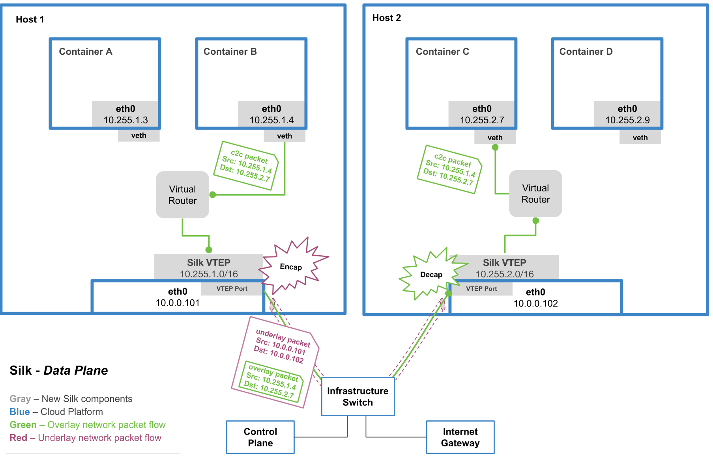

# Silk

> Note: This repository should be imported as `code.cloudfoundry.org/silk`.

Silk is an open-source, [CNI](https://github.com/containernetworking/cni/)-compatible container networking fabric.
It was inspired by the [flannel](https://github.com/coreos/flannel) VXLAN backend and designed to meet the strict
operational requirements of [Cloud Foundry](https://cloudfoundry.org/platform/).

To see how Silk is used inside of Cloud Foundry, look at the [CF Networking Release](https://code.cloudfoundry.org/cf-networking-release).

## Architecture

### Control plane

Silk has three components:

- `silk-controller` runs on at least one central node and manages IP subnet lease allocation across the cluster.
   It is implemented as a stateless HTTP JSON API backed by a SQL database.

- `silk-daemon` runs on each host in order to acquire and renew the subnet lease for the host by calling the `silk-controller` API.  It also has an HTTP JSON API endpoint that serves the subnet lease information and also acts as a health check.

- `silk-cni` is a short-lived program, executed by the container runner, to set up the network stack for a particular container.  Before setting up the network stack for the container, it calls the `silk-daemon` API to check its health and retrieve the host's subnet information.

### Data plane

The Silk dataplane is a virtual L3 overlay network.  Each container host is assigned a unique IP address range,
and each container gets a unique IP from that range.

The virtual network is constructed from three primitives:
- Every host runs one virtual L3 router (via Linux routing).
- Each container on a host is connected to the host's virtual router via a dedicated virtual L2 segment, one segment per container (point-to-point over a virtual ethernet pair).
- A single shared [VXLAN](https://tools.ietf.org/html/rfc7348) segment connects all of the the virtual L3 routers.

Although the shared VXLAN network carries L2 frames, containers are not connected to it directly.  They only access the VXLAN segment via their host's virtual L3 router.  Therefore, from a container's point of view, the container-to-container network carries L3 packets, not L2.

To provide multi-tenant network policy on top of this connectivity fabric, Cloud Foundry utilizes the
[VXLAN GBP](https://tools.ietf.org/html/draft-smith-vxlan-group-policy-03#section-2.1) extension to tag
egress packets with a policy identifier.  Other network policy enforcement schemes are also possible.
